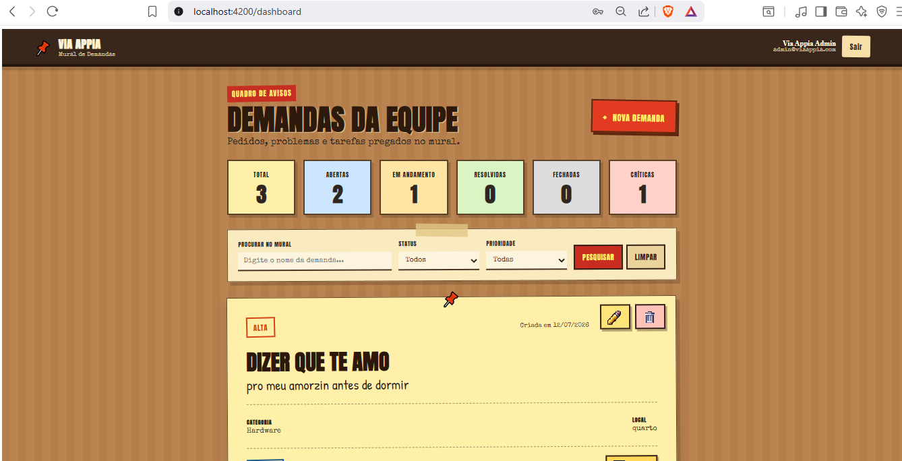
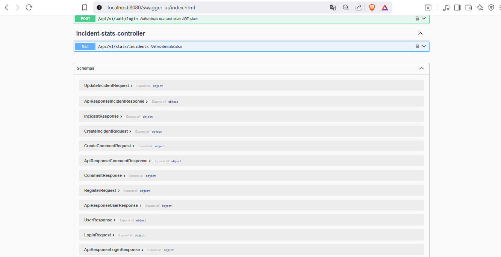

# 🚨 Sistema de Gerenciamento de Incidentes

> Projeto Full Stack desenvolvido para o **Desafio Técnico Full Stack da Via Appia**, utilizando Java, Spring Boot, Angular, PostgreSQL e Docker.

---
# 🔑 Usuários para Teste

| Perfil | E-mail | Senha |
|---------|---------|--------|
| Administrador | admin@viaappia.com | Admin@123 |
| Usuário | usuario@viaappia.com | Usuario123 |

---
# 📸 Demonstração

## Login


---

## Dashboard



---

## Swagger



---

# 📖 Sobre

O Sistema de Gerenciamento de Incidentes foi desenvolvido para facilitar o registro, acompanhamento e gerenciamento de incidentes operacionais.

O projeto foi construído utilizando boas práticas de desenvolvimento Full Stack, arquitetura em camadas e autenticação baseada em JWT.

---

# ✨ Funcionalidades

## 🔐 Autenticação

- Login
- Cadastro de usuários
- JWT
- Spring Security
- BCrypt
- Controle de acesso por perfis (Roles)

---

## 📋 Incidentes

- Criar incidente
- Editar incidente
- Excluir incidente
- Buscar incidente
- Paginação
- Pesquisa por título

Filtros disponíveis:

- Status
- Prioridade
- Categoria

---

## 📊 Dashboard

Indicadores em tempo real:

- Total de incidentes
- Abertos
- Em andamento
- Resolvidos
- Fechados
- Críticos

---

## 📄 Swagger

Documentação completa da API.

---

## 💬 Comentários

- Cadastro de comentários


---

## 🐳 Docker

Projeto totalmente containerizado.

Containers:

- PostgreSQL
- Backend Spring Boot
- Frontend Angular (Nginx)

---

# 🏗 Arquitetura

```
Angular 20
      │
HTTP + JWT
      │
Spring Boot REST API
      │
Spring Security
      │
Spring Data JPA
      │
Flyway
      │
PostgreSQL
```

---

# 🛠 Tecnologias

## Backend

- Java 21
- Spring Boot 3
- Spring Security
- Spring Data JPA
- Hibernate
- Flyway
- JWT
- Maven
- Swagger
- Caffeine Cache

---

## Frontend

- Angular 20
- TypeScript
- HTML5
- CSS3
- RxJS

---

## Banco

- PostgreSQL 16

---

## Infraestrutura

- Docker
- Docker Compose
- Nginx

---

# 📂 Estrutura

```
incident-management-system

backend/
frontend/
docs/

docker-compose.yml
README.md
```

---

# 🚀 Como Executar

## Clonar

```bash
git clone https://github.com/flipadoone/incident-management-system.git

cd incident-management-system
```

---

## Docker

Executar toda a aplicação:

```bash
docker compose up --build
```

---

#não precisa# Execução manual

### Banco

```bash
docker compose up -d
```

### Backend

```bash
cd backend

./mvnw spring-boot:run
```

### Frontend

```bash
cd frontend

npm install

ng serve
```

---

# 🌐 Endereços

Frontend

```
http://localhost:4200
```
Swagger

```
http://localhost:8080/swagger-ui/index.html
```

---

# 🔑 Usuários para Teste

| Perfil | E-mail | Senha |
|---------|---------|--------|
| Administrador | admin@viaappia.com | Admin@123 |
| Usuário | usuario@viaappia.com | Usuario123 |

---

# 📌 Principais Endpoints

## Autenticação

```
POST /api/v1/auth/login
POST /api/v1/auth/register
```

## Incidentes

```
GET
POST
PUT
DELETE
```

## Estatísticas

```
GET /api/v1/stats/incidents
```

## Comentários

```
GET
POST
```

---

# 🔒 Segurança

- JWT
- Spring Security
- BCrypt
- Sessão Stateless
- Controle de acesso por Roles

---

# ⚡ Recursos Implementados

- Cache com Caffeine
- Paginação
- Filtros
- DTOs
- UUID
- Flyway
- Docker Compose
- Swagger/OpenAPI

---

# ✅ Status do Projeto

## Funcionalidades concluídas

- ✔ Autenticação JWT
- ✔ Cadastro de usuários
- ✔ Controle de perfis
- ✔ CRUD de incidentes
- ✔ Dashboard
- ✔ Estatísticas
- ✔ Paginação
- ✔ Filtros
- ✔ Comentários (API)
- ✔ PostgreSQL
- ✔ Flyway
- ✔ Swagger
- ✔ Docker Compose
- ✔ Frontend responsivo
- ✔ Cache

---

## Melhorias Futuras

- Melhorias na interface dos comentários
- Dashboard com gráficos
- Relatórios
- Testes automatizados
- Pipeline CI/CD
- Deploy em nuvem

---

# 👨‍💻 Desenvolvedor

**Filipe Lopes dos Santos**

Projeto desenvolvido para o **Desafio Técnico Full Stack da Via Appia**.

---

# 📄 Licença

Projeto desenvolvido exclusivamente para fins de avaliação técnica.
